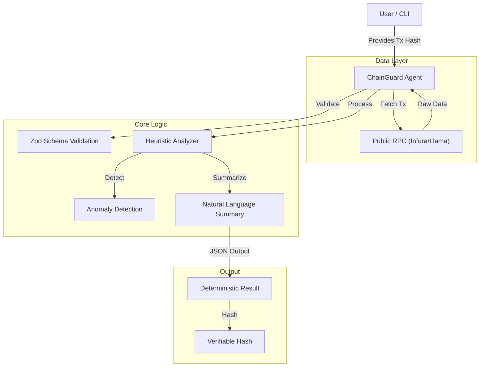

# ChainGuard AI — Web3 Wallet Intelligence Agent

> A deterministic, verifiable agent that acts as a "Check Engine Light" for your crypto wallet.

[](https://opensource.org/licenses/ISC)
[](https://github.com/faishaldev/chainlens-ai)

## 1. Problem
Blockchain transaction data is **noisy, technical, and hard to interpret**.
- Users struggle to understand gas spending or complex protocol interactions.
- Existing explorers (Etherscan) show *raw data*, not *insights*.
- Safety risks (anomalous values, high gas) often go unnoticed until it's too late.

**ChainGuard AI** solves this by converting raw on-chain data into clear, human-readable insights with anomaly detection.

## 2. Architecture

The agent operates as a standalone TypeScript library that connects to public RPC nodes to fetch live data, normalizes it, and runs heuristic analysis.



## 3. Tech Stack
- **Language**: TypeScript (Node.js)
- **Blockchain Interaction**: Ethers.js v6
- **Validation**: Zod
- **Testing**: Vitest
- **Architecture**: Modular (Formatter, Analyzer, Validator, Chain Source)

## 4. Screenshots / Usage

### Running Analysis on a Real Transaction
```bash
npm start 0x4c0140d2980709a1252f529495e862d3ddd6ab1080f9d96aec5abaa2f30834d5
```

**CLI Output:**
```json
{
  "summary": "Analyzed 1 transaction(s). Total gas used: 155411 (avg: 155411 per tx). detected 1 anomalie(s).",
  "analysis": {
    "total_gas": 155411,
    "average_gas": 155411,
    "transaction_count": 1,
    "category_breakdown": {
      "contract_call": 1
    },
    "anomalies": [
      "High gas used: 155411 in tx 0x4c0140d2980709a1252f529495e862d3ddd6ab1080f9d96aec5abaa2f30834d5"
    ]
  },
  "hash": "c9e4235883ba03074efa8a74560f54abf5057ae712b4abc36e31c26f0222d074"
}
```

## 5. Getting Started

1.  **Install dependencies**
    ```bash
    npm install
    ```

2.  **Run Tests**
    ```bash
    npm test
    ```

3.  **Run Agent**
    ```bash
    # Run with sample data
    npm start

    # Run with a specific transaction hash
    npm start <TX_HASH>
    ```
